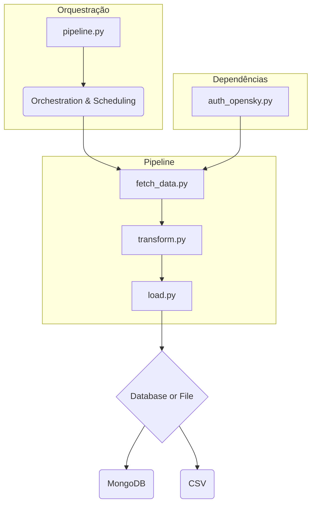
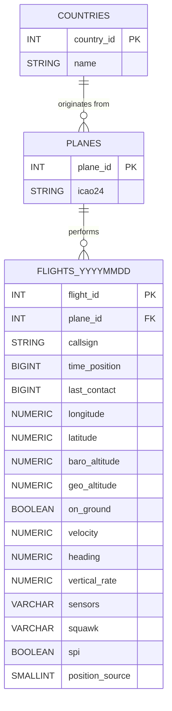
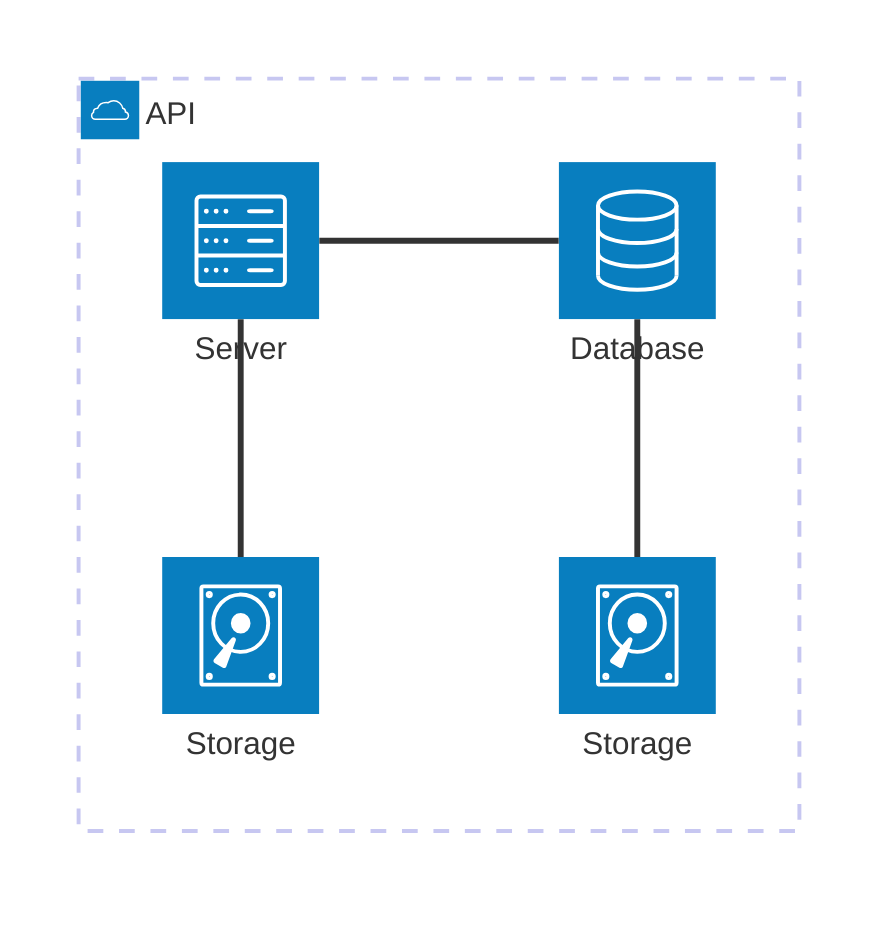

### Exploratory Data Analysis (EDA) - `01_exploration.ipynb`

Before designing the pipeline and database, a thorough understanding of the flight data is crucial. **The EDA phase aimed to uncover trends, distributions, and potential anomalies** within the data retrieved from the OpenSky API. Rather than focusing on raw numbers, the analysis emphasizes insights, motivations, and implications for the subsequent pipeline and database design.

#### Objectives

* **Acquire and Structure Data:** Get the raw flight data from the OpenSky Network API and transform it into a clean, structured pandas DataFrame for easy manipulation and analysis.

* **Assess Data Quality:** Identify and document key data quality issues, such as missing values, physically impossible data points (e.g., negative altitudes), and measurement errors (e.g., unrealistic speeds or vertical rates).

* **Handle Outliers:** Develop a strategy to address and either correct, flag, or remove anomalous data points that fall outside of realistic physical bounds.

* **Visualize Key Distributions:** Create initial visualizations, such as the bar chart of flight origins, to gain a preliminary understanding of the data's characteristics and geographical distribution.

* **Prepare Data for Further Analysis:** Ultimately, the objective is to clean and prepare the dataset so that it can be reliably used for more advanced analysis, such as building predictive models or deriving deeper insights.

#### Key Analytical Steps
1. **Data Ingestion and Transformation**
The analysis begins by fetching raw data from the OpenSky Network API in a nested JSON format. This raw data is then processed and converted into a structured pandas DataFrame. This transformation is crucial as it organizes the data into a tabular format, which is essential for efficient data manipulation, filtering, and statistical analysis. This is accomplished by creating a pandas DataFrame named `df_final`.

2. **Data Cleaning and Quality Assessment**
The core of this initial analysis is to understand the quality of the data and identify any issues that could skew future results. Several key observations and actions were made:

    * **Considering Missing Data:** Columns like `category` and `sensors` are noted for potential removal in a later data pipeline step due to a complete lack of usable data.This is a form of feature reduction, which simplifies the dataset and removes irrelevant noise. It's a standard practice to drop features with no variance or missing values.
    * **Timestamp Conversion:** Raw Unix timestamps are converted into a human-readable datetime format, which is vital for any time-series analysis or for calculating time-based metrics like flight duration.
    Outlier and Anomaly Detection: The analysis makes specific notes about identifying values that fall outside of a realistic physical range.

    * **Altitude:** It notes that `baro_altitude` and `geo_altitude` can have small negative values. The correct approach is to **either set these to zero or filter them out, as negative altitude is physically impossible in this context.**

    * **Vertical Rate:** The notebook points out extremely high or low values for `vertical_rate` (e.g., -165 m/s), indicating sensor error or data corruption. The proposed solution of **either capping the values within a realistic range (-30 to +30 m/s) or discarding them is a robust way to handle such outliers.**

    * **Velocity:** The analysis flags velocities above ~320 m/s as potentially anomalous. This suggests a need for a deeper look into these specific data points to understand if they represent a valid, albeit rare, event (like a military jet) or are simply measurement errors.
3. **Flight Behavior and Characteristics**

    **Spatial Distribution:**
The analysis examines the geographical spread of flight data. A bar chart of `origin_country` highlights where most active flights originate.

    * **Objective:** Understand the global or regional concentration of flights.

    * **Method:** Counting occurrences of each country in `origin_country` using `value_counts()`, then visualizing with a bar chart.

    * **Takeaway:** Provides insight into dataset biases, indicating if certain regions dominate the data, which informs decisions for subsequent analyses or data supplementation.

    **Temporal Distribution:**
    Although not explicitly visualized, temporal analysis is prepared through timestamp conversion.

    * **Objective:** Enable analysis of flight patterns over time, including peak activity periods.
    * **Method:** Unix timestamps (`time_position`, `last_contact`) are converted to datetime format, allowing time-based calculations.
    * **Takeaway:** Prepares the dataset for analyses like flight volume over time, flight duration, and lag between recorded events.

    **Altitude, Velocity, and Vertical Rate:**
    Key flight characteristics are explored to identify patterns and anomalies.

    * **Objective:** Understand flight dynamics and detect unusual behaviors.
    * **Method:** Scatter plots of `baro_altitude` vs `velocity` and `vertical_rate` vs `baro_altitude`; histograms of `vertical_rate`.
    * **Takeaway**: Visualizations reveal normal flight profiles, highlight outliers, and provide context for further analysis or model validation.

#### Key Takeouts and Insights

* **Altitude:** Small negative values in baro_altitude and geo_altitude are physically impossible and should be rounded to 0.

* **Vertical Rate:** Extreme values (e.g., -165 m/s) indicate sensor errors and should be discarded or capped to a realistic range (-30 to +30 m/s).

* **Velocity:** Speeds above ~320 m/s are rare and should be reviewed as anomalies.

* **Feature Reduction:** Columns with missing or irrelevant data (category, sensors, possibly squawk) can be removed to simplify the dataset.

This data cleaning and quality assessment ensures the dataset is reliable and consistent. Handling missing values, converting timestamps, and addressing outliers in altitude, vertical rate, and velocity provide a strong foundation for accurate analysis and future pipeline automation. These steps not only improve the accuracy of subsequent analyses but also guide the design of the **data pipeline**, enabling more efficient, automated handling of incoming flight data.

___
### Pipeline - `pipeline.py`
This data engineering pipeline is designed to extract, transform, and load flight data from the OpenSky Network API. It automates the process of collecting raw data, applying cleaning and transformation rules, and then storing the processed data in a MongoDB collection. The pipeline's modular structure makes it easy to maintain and extend for future stages.

#### Pipeline Flow
The pipeline follows a simple **Extract-Transform-Load (ETL)** approach, where each stage is encapsulated in a separate Python module to ensure a separation of responsibilities, orchestrated by the main script `pipeline.py`.
##### Pipeline Diagram




___
### Database Modeling Decisions

A critical aspect of this project is how flight data is stored, accessed, and maintained over time. Instead of relying on a single, ever-growing monolithic table, **we adopted a daily table strategy** to optimize performance, maintainability, and query simplicity.

#### Table Structure

* Flight records are stored in daily tables following the naming pattern:
```console
FLIGHTS_YYYYMMDD
```
Example: `FLIGHTS_20250828`

* Reference tables such as `PLANES`, `COUNTRIES`, and other static entities remain non-partitioned, as their size and update frequency are much smaller compared to flight records.

#### Why Daily Tables?
**1. Performance**

* **Data Growth:** Flight data increases rapidly, with thousands or millions of new entries each day.

* **Query Efficiency:** By targeting only the relevant daily tables, queries scan significantly less data than a monolithic table.

* **Faster Responses:** Most operational and analytical queries focus on a narrow time window (e.g., the last 24–48 hours), making daily tables ideal.

**2. Query Simplicity**

* **Flight Duration:** Most flights last less than 24 hours.

* **Completeness:** Queries spanning 1–2 days (e.g., a UNION of consecutive daily tables) capture entire flights without missing data.

* **Ease of Use:** Developers avoid complex filtering logic; just include the tables for the dates needed.

**3. Maintainability**

* **Archival:** Old tables can be moved to cheaper storage without affecting current operations.

* **Backup & Restore:** Daily granularity simplifies backup strategies — only recent tables need frequent backups.

* **Data Lifecycle Management:** Dropping outdated tables (e.g., older than 2 years) is straightforward and non-disruptive.

#### Trade-offs Considered

| Strategy                  | Pros                                                                 | Cons                                                                                   |
|----------------------------|----------------------------------------------------------------------|---------------------------------------------------------------------------------------|
| Single Monolithic Table    | Easy initial setup                                                   | Queries degrade as dataset grows; indexing becomes costly                              |
| Monthly / Yearly Tables    | Fewer tables to manage                                               | Querying a single day scans millions of rows; archival less granular                  |
| **Daily Tables (Chosen)**      | Optimized for performance, simplicity, and maintainability; matches natural temporal distribution | More tables to manage; requires UNION for multi-day queries |

#### Entity-Relationship Diagram (ERD)


<!---


--->

#### Future Extensions

Although SQLite does not support advanced partitioning features, the following ideas could apply in more robust database engines:

* **Automated Table Creation:** Scheduled jobs can create the next day’s table in advance.

*  **Historical Aggregation:** Older tables could be summarized into monthly or yearly aggregated tables for faster historical queries.

* **Hybrid Strategy Concept:** High-granularity daily tables for recent data combined with aggregated historical tables for analytics.
>[!NOTE]
>In SQLite, queries still need to manually reference the tables of interest. Concepts like partition pruning are included here only for conceptual completeness.

#### Example Queries

**Query flights for a single day:**
```sql
SELECT * 
  FROM flights_20250828;
```
**Query flights across two days:**

```sql
SELECT * FROM flights_20250828
UNION ALL
SELECT * FROM flights_20250829;
```

## Acknowledgements

This project uses data from the OpenSky Network. We thank the OpenSky team for providing access to their ADS-B sensor network.

Reference:
Matthias Schäfer, Martin Strohmeier, Vincent Lenders, Ivan Martinovic and Matthias Wilhelm.
"Bringing Up OpenSky: A Large-scale ADS-B Sensor Network for Research".
In Proceedings of the 13th IEEE/ACM International Symposium on Information Processing in Sensor Networks (IPSN), pages 83-94, April 2014.

Website: [https://opensky-network.org](https://opensky-network.org)
