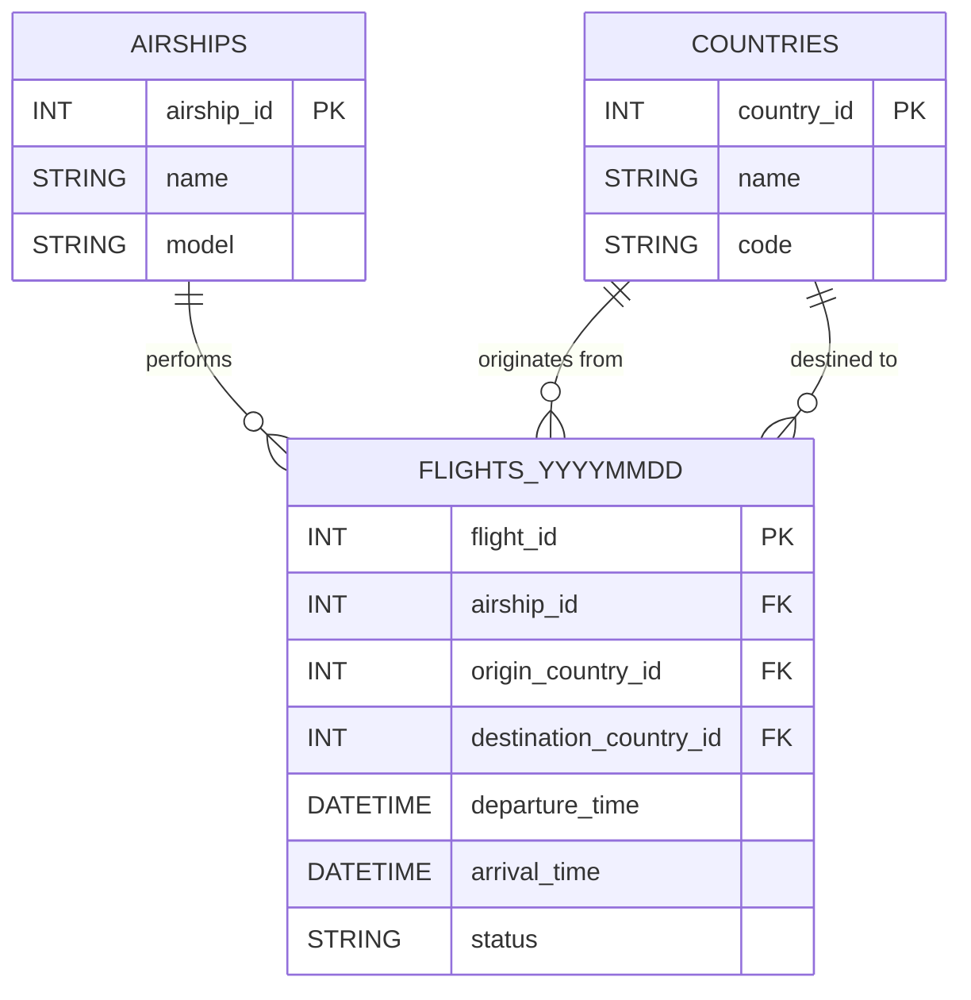

Database Modeling Decisions

A critical aspect of this project is how flight data is stored, accessed, and maintained over time. Instead of relying on a single, ever-growing monolithic table, we adopted a daily table strategy to optimize performance, maintainability, and query simplicity.

Table Structure

Flight records are stored in daily tables following the naming pattern:

flights_YYYYMMDD

Example:

flights_20250828

Reference tables such as airships, countries, and other static entities remain non-partitioned, as their size and update frequency are much smaller compared to flight records.

Why Daily Tables?
1. Performance

Data Growth: Flight data increases rapidly, with thousands or millions of new entries each day.

Query Efficiency: By targeting only the relevant daily tables, queries scan significantly less data than a monolithic table.

Faster Responses: Most operational and analytical queries focus on a narrow time window (e.g., the last 24–48 hours), making daily tables ideal.

2. Query Simplicity

Flight Duration: Most flights last less than 24 hours.

Completeness: Queries spanning 1–2 days (e.g., a UNION of consecutive daily tables) capture entire flights without missing data.

Ease of Use: Developers avoid complex filtering logic; just include the tables for the dates needed.

3. Maintainability

Archival: Old tables can be moved to cheaper storage without affecting current operations.

Backup & Restore: Daily granularity simplifies backup strategies — only recent tables need frequent backups.

Data Lifecycle Management: Dropping outdated tables (e.g., older than 2 years) is straightforward and non-disruptive.

Trade-offs Considered
Strategy	Pros	Cons
Single Monolithic Table	Easy initial setup	Queries degrade as dataset grows; indexing becomes costly
Monthly / Yearly Tables	Fewer tables to manage	Querying a single day scans millions of rows; archival less granular
Daily Tables (Chosen)	Optimized for performance, simplicity, and maintainability; matches natural temporal distribution	More tables to manage; requires UNION for multi-day queries
Future Extensions

Although SQLite does not support advanced partitioning features, the following ideas could apply in more robust database engines:

Automated Table Creation: Scheduled jobs can create the next day’s table in advance.

Historical Aggregation: Older tables could be summarized into monthly or yearly aggregated tables for faster historical queries.

Hybrid Strategy Concept: High-granularity daily tables for recent data combined with aggregated historical tables for analytics.

Note: In SQLite, queries still need to manually reference the tables of interest. Concepts like partition pruning are included here only for conceptual completeness.

### Entity-Relationship Diagram (ERD)

## Acknowledgements

This project uses data from the OpenSky Network. We thank the OpenSky team for providing access to their ADS-B sensor network.

Reference:
Matthias Schäfer, Martin Strohmeier, Vincent Lenders, Ivan Martinovic and Matthias Wilhelm.
"Bringing Up OpenSky: A Large-scale ADS-B Sensor Network for Research".
In Proceedings of the 13th IEEE/ACM International Symposium on Information Processing in Sensor Networks (IPSN), pages 83-94, April 2014.

Website: [https://opensky-network.org](https://opensky-network.org)
